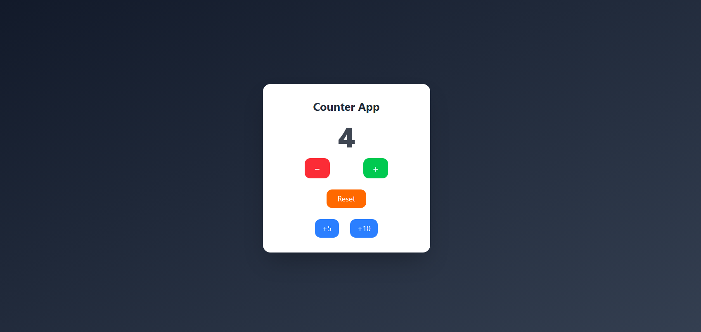

# Counter App (React)

A simple and interactive **Counter Application** built using **React** and styled with **Tailwind CSS**.  
This project demonstrates core React concepts such as state management, conditional rendering, and event handling.

---

## 🚀 Features

- ➕ Increment counter by **1, 5, or 10**
- ➖ Decrement counter (disabled when value is `0`)
- 🔄 Reset counter to `0`
- 🎨 Clean UI with gradient background and smooth transitions
- 🧠 Prevents negative counter values

---

## 🛠️ Tech Stack

- **React** (useState Hook)
- **JavaScript (ES6)**
- **Tailwind CSS**
- **Vite / Create React App** (depending on your setup)

---

## 📂 Project Structure

counter-app/
├── public/
├── src/
│   ├── components/
│   │   └── Counter.jsx
│   ├── App.jsx
│   ├── index.css
│   └── main.jsx
├── package.json
├── tailwind.config.js
└── README.md

---

## 🧩 Key Concepts Used

- `useState` for state management
- Functional state updates (`prev => prev + 1`)
- Conditional button disabling
- Reusable event handlers
- Basic UI animations using Tailwind utility classes

---

